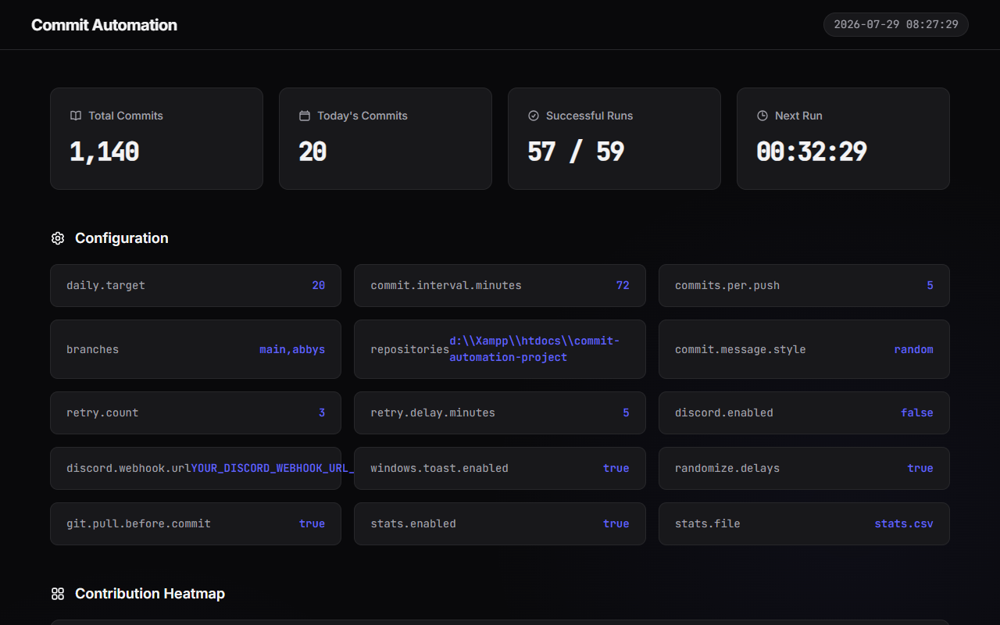

# Commit Automation

Automate your GitHub commits effortlessly and keep your contribution graph active. This project includes a robust Java-based automation core and a modern, premium web dashboard to monitor your commit history.

## Dashboard Preview



## Project Structure

```text
commit-automation-project/
│   auto_daily.bat          # Script executed by the task scheduler
│   config.properties       # Configuration for commit targets, branches, etc.
│   GitHell.class           # Compiled Java automation core
│   GitHell.java            # Source code for the automation core
│   INSTALL_SCHEDULER.bat   # Sets up the Windows Task Scheduler automatically
│   start.bat               # Manual trigger to start the automation
│   stats.csv               # Database for the dashboard (Run history)
│   stop.bat                # Stops the running automation process
│   
├───abyss/                  # Project files modified during commits
│       backdated_2026_07_25.txt
│       README.yml
│       
├───dashboard/              # Premium Web Dashboard (PHP/CSS)
│       index.php
│       style.css
│       
└───logs/                   # Daily execution logs
        daily_*.log
```

## Getting Started

### 1. Backend Automation
1. Open `config.properties` and configure your settings (e.g., `daily.target`, `branches`).
2. Run `INSTALL_SCHEDULER.bat` as Administrator to automatically set up a daily Windows Task Scheduler job.
3. Alternatively, you can run `start.bat` to trigger the automation manually at any time.

### 2. Web Dashboard
1. Ensure your local server environment (like XAMPP Apache) is running.
2. Place this project inside your `htdocs` folder.
3. Open your web browser and navigate to:
   `http://localhost/commit-automation-project/dashboard/`

## Core Features
- **Smart Delays**: Randomizes time between commits to simulate human behavior.
- **Auto Recovery**: Automatically retries if a push or commit fails.
- **Heatmap Visualization**: Tracks your commits with an elegant 12-week contribution heatmap.
- **Modern UI**: A sleek, dark-mode-first dashboard with glassmorphism and smooth micro-animations.
